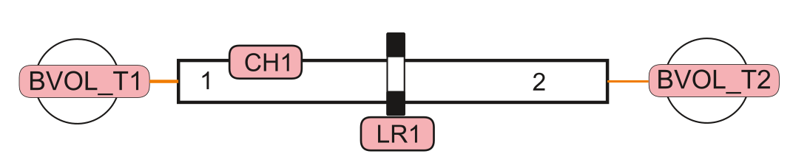

# Пример простейшей задачи на КОРСАР

## 1. Цель работы
Получить значение квазистатического расхода воды через участок трубы с установленным дросселем

### Навыки, приобретаемые по результатам выполнения работы
> - умение составлять зону задания расчетного варианта кода КОРСАР 
> - умение работать с запуском расчета и обработкой результатов расчета кода КОРСАР 
> - отработка навыков работы с репозиториями расчетной задачи
---
## 2. Описание постановки задачи
В задаче моделируется течение через участок трубы DN25 длиной 1м

Параметры задачи представлены в таблице
|Параметр|Значение|
---|:---:|
|Температура потока |20°C|
|Давление на входе |1 МПа|
|Давление на выходе  |1.1 МПа|
|$\xi$ дросселя  |7.|
|Длина и диаметр трубы, м   |1, 0.025|
---
## 3. Требуемые результаты
- Вывести графики давления до дросселя и расхода через дроссель
- Определить значение установившегося расхода
---
## 4. Формат отчетности
В отчетность по лабораторной работе входит:
- файлы зоны задания kordat и kutdat;
- файлы, необходимые для обработки результатов расчета на python/Jupyter Notebook;
- отчет в электронном виде по [шаблону](./report_template.md);
- ссылка на репозиторий и папку лабораторной работы, содержащий указанные данные
---
## 5. Список литературы
- КОРСАР/В3. Руководство пользователя (https://korsar.niti.ru)
- Справка по Git https://git-scm.com/docs/git-help
- Шпаргалка по Git https://gist.github.com/mewforest/6ee59caa4a4032d95714244c2cd1733d
- Как писать формулы на LaTeX https://www.overleaf.com/learn/latex/List_of_Greek_letters_and_math_symbols