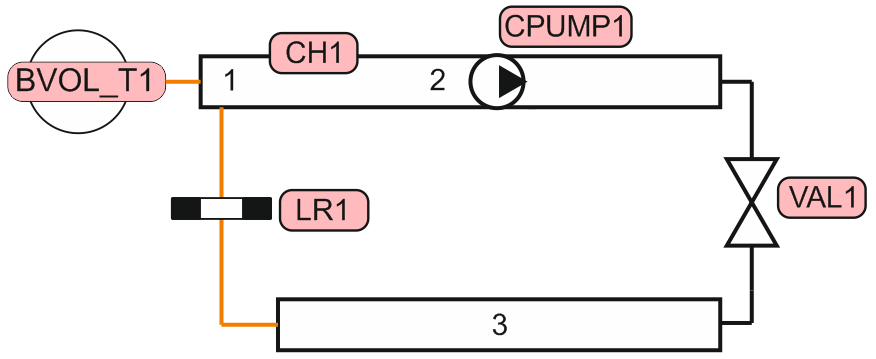
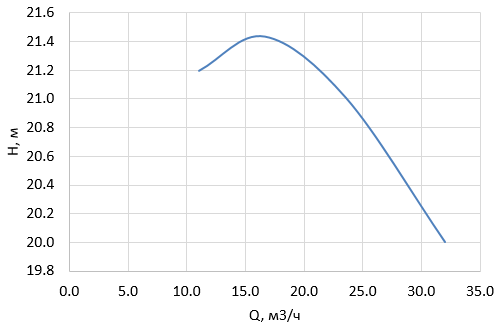

# Лабораторная работа №2. Определение расходной характеристики регулирующей арматуры при работе на реальную гидравлическую трассу

## 1. Цель работы
Целью работы является получение расходной характеристики регулирующей арматуры при ее работе в гидравлической сети методом расчетного моделирования в системном теплогидравлическом коде КОРСАР.  

### Навыки, приобретаемые по результатам выполнения работы
> - умение составлять зону задания расчетного варианта кода КОРСАР 
> - умение работать с элементами CH, VAL, BVOL_T, LR, CPUMP
> - умение обрабатывать результаты расчета кода 
> - умение оценивать регулирующие характеристики арматуры при ее работе в гидравлической сети
---
## 2. Описание постановки задачи
В задаче моделируется течение через регулирующий клапан (РК), установленный на участке трубопровода DN50 (длина ячеек канала составляет по 1 м, ячейка 3 канала имеет DN100) совместно с последовательной установленным гидравлическим сопротивлением (потребителем). Течение организовано при помощи задания характеристики насоса. Нодализация расчетного варианта представлена на рисунке ниже

Характеристика насоса представлена на рисунке 
 

Параметры задачи представлены в таблице
|Параметр|Значение|
---|:---:|
|Температура потока |20°C|
|Давление на всасе насоса |1 МПа|
|$Kv_у$ клапана  |33|
|Пропускная характеристика   |Линейная|
|КГС местного сопротивления   |140|
Характеристику насоса задать при помощи интерполяции табличных значений или путем аппроксимации полиномом в режиме задания перепада насоса (MODE=2)
---
## 3. Требуемые результаты
- Определить расходную характеристику РК в абсолютном и относительном виде ($Kv_{отн}=f(s)$), сравнить с пропускной. Определение расходной характеристики произвести путем изменения положения рабочего органа РК и регистрации соответствующего расхода, протекающего через РК и дальнейшей нормировки (при необходимости).
- Исследовать изменение расходной характеристики РК в зависимости от КГС местного сопротивления в диапазоне -80%...+150% от заданной величины.
---
## 4. Формат отчетности
В отчетность по лабораторной работе входит:
- файлы зоны задания kordat и kutdat
- отчет в **электронном виде** (формат произвольный), содержащий:
  - постановку задачи
  - нодализацию расчетного варианта
  - графики пропускной и расходной характеристик РК (в относительных единицах) в одних осях 
  - график расходной характеристики РК в зависимости от модуля гидравлической системы

## 5. Список литературы
- Э.Е.Благов, Б.Я.Ивницкий Дроссельно-регулирующая арматура ТЭС и АЭС. - М.: Энергоатомиздат, 1990. - 288 с.: ил.
- РТМ 108.711.02-79 Арматура энергетическая. методы определения пропускной способности регулирующих органов и выбор оптимальной раходной характеристики
- КОРСАР/В3. Руководство пользователя (https://korsar.niti.ru)

## 6. Контрольные вопросы
- По коду КОРСАР
  - Какие есть способы оценки гидравлических потерь на участке?
  - Как оценить проходное сечение и длину i-го соединения канала?
  - Какие есть способы задания характеристики центробежного насоса?
- По задаче
  - Что такое модуль гидравлической системы? Что такое коэффициент формы регулировочной характеристики? 
  - Каковы критерии выбора пропускной характеристики РК?

## Сокращения и обозначения
DN - условный проход
Kv - пропускная способность клапана
Q - объемный расход
s - относительное положения рабочего органа
КГС - коэффициент гидравлического сопротивления
РК - регулирующий клапан
РО - регулирующий орган
